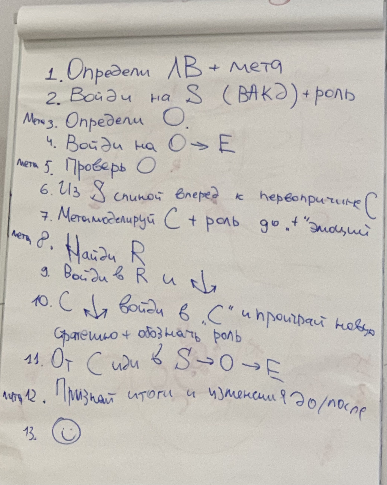

### Занятие 7. SCORE на линии времени по зубакову

На последнем шаге признаем изменения до и после сессии

Я признаю изменния в речи, теперь я могу говорить уверенно и мотивировать аудиторию

13. Первые шаги