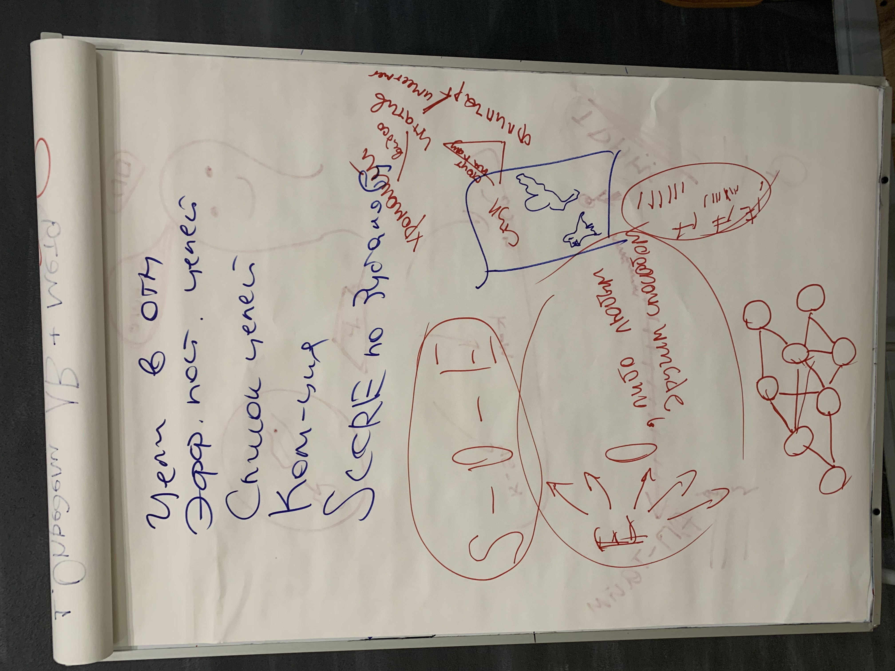

### Занятие 8. Графовые системы

Ноутбук -> Телефон (излучают свет)  
Телефон -> Штатив (не поглощают черный цвет, черного цвета)  
Штатив -> Флип-боард (стоят на ножках)  
Флип-боард -> Стол (имеют в своем основании твердую панель)  
Стол -> Разетка (созданы человеком)

Общее все предметы имеют металлические компоненты

Эффекты -> Цель

Я хочу бегать от работы домой и от дома на работу каждый день

для этого мне нужно оставить ноутбук на работе
так как с рюкзаком бегать неудобно

Конфликты зачастую возникают так как люди не проговаривают намерение

Модель коммуникации по Зубакову  
I - мои физичиские дейтствия и мое отношение к ним  
II - физические действия и отношение других людей  
III - ссылка на внешние обьекты, контекст  
IV - экология, насколько система будет долговечной и жизнеспособной

Вы идете на нетворкинг,
I я хочу пообщаться, я хочу хорошо провести время,  
II дать свой контакт другим людям, хочу чтобы они веселили меня  
III собрать 20 контактов номеров спикеров, там будет плов, там будут играть в волейбол

Любой разговор нужно начинать с этих трех пунктов

Я хотел бы на выходных поехать к родителям на выходных,
так как я хочу

Слушая хочу посмотреть крутое кино, в кино довод идет, ты как как этому отнсоишься

Те люди которые учитывают  
I и III намерение - это blamer, решает за других  
II и III - это complainer жалобщик  
III - информатор

I - Я хочу поесть  
II - Ты хочешь поесть? (Какие планы на вечер, Я тебя люблю)  
III - В Italiani лапша за 320р  

I II - Я хочу есть, ты как?  
I III - Я хочу поесть в итальяни карбонару за 320р, ты как?  
II III Ты хочешь поесть в итальяни карбонару за 320р ?  

https://ru.wikipedia.org/wiki/%D0%A1%D0%B0%D1%82%D0%B8%D1%80,_%D0%92%D0%B8%D1%80%D0%B4%D0%B6%D0%B8%D0%BD%D0%B8%D1%8F

Поехать в отпуск вместе
Предложить бизенс партнерство
Позвать на вечер куда-то (предложение на вечер)

1. Привет, у меня отпуск с 20 по 27 января 2021 года и я хочу поехать на Мачу Пикчу, какие у тебя планы?
2. Привет, мы хотим найти компанию партнера я занимаюсь брендированием упаковок у меня есть желания упаковывать крутые бренды чтобы клиенты их узнавали и я заметил что у тебя в Чикенаторе еще нет бренда, какие у вас планы на упаковку? 
3. Привет, сегодня вечером будет сеанс изучения строения людей в Морге и я планирую на него пойти, не хочешь пойти со мной?

#### Формулировка партнерства:
Я хочу внешний X, Вася это тоже хочет, поэтому мы вместе делаем Y.

Я хочу чтобы люди вкусно питались за 300 рублей в день, Вася тоже хочет помогать людям вкусно есть, поэтому мы запускаем доставку еды.

партенрство - про общие внешние цели

------------------------------------------------------------------

начинать цели нужно с самого конца
достижение цели идет в состоянии как будто я уже достиг цель, а цель перед глазами